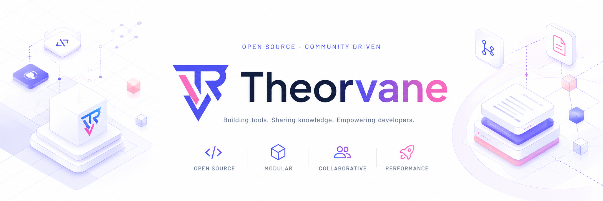

  
  
  <h1>Theorvane</h1>

  **Open-source developer tools for explicit contracts and inspectable systems.**

  <a href="https://theorvane.tech">Website</a>
  &nbsp;&nbsp;•&nbsp;&nbsp;
  <a href="https://typemcp.theorvane.tech">TypeMCP</a>
  &nbsp;&nbsp;•&nbsp;&nbsp;
  <a href="https://github.com/Theorvane">GitHub</a>

## Welcome

Theorvane builds focused, verifiable tools for developers and AI-native systems. We favor small public surfaces, typed contracts, transparent capability boundaries, and evidence-backed releases.

## Official repositories

| Repository | What it is | Status |
| --- | --- | --- |
| [**TypeMCP**](https://github.com/Theorvane/type-mcp) | Decorator-first TypeScript declarations for Model Context Protocol (MCP) servers. | [`type-mcp@0.1.0`](https://www.npmjs.com/package/type-mcp) publishes standard decorators and immutable metadata reads. Runtime compilation, transports, and integrations are not part of that published package release. |
| [**website**](https://github.com/Theorvane/website) | The public sites for [Theorvane](https://theorvane.tech) and [TypeMCP](https://typemcp.theorvane.tech). | Public Next.js monorepo. |
| [**type-mcp-api-agent-skill**](https://github.com/Theorvane/type-mcp-api-agent-skill) | Hermes orchestration skill and deterministic CLI workspace for API-to-TypeMCP workflows. | Local OpenAPI/Swagger inspection is implemented; remote intake, generation, and the CLI package publication remain intentionally unshipped. |

## Open source, with clear boundaries

Open source should be usable and honest. Repository work may move ahead of a published package, so each project documents what is available today and what remains planned. Please rely on the package README and release notes for the current public API.

## Contributing

We welcome focused contributions:

1. Search existing Issues before starting work.
2. Open or update an Issue with the problem, scope, and acceptance criteria.
3. Keep pull requests small, tested, and aligned with the repository's `AGENTS.md`.
4. Do not include secrets, generated output, or unverified capability claims.

For a security concern, please follow our [security policy](../SECURITY.md) instead of creating a public Issue.

## Community

- Visit [theorvane.tech](https://theorvane.tech) for the studio and projects.
- Visit [typemcp.theorvane.tech](https://typemcp.theorvane.tech) for the TypeMCP product site.
- Use GitHub Issues in the relevant repository for reproducible bugs and scoped proposals.
